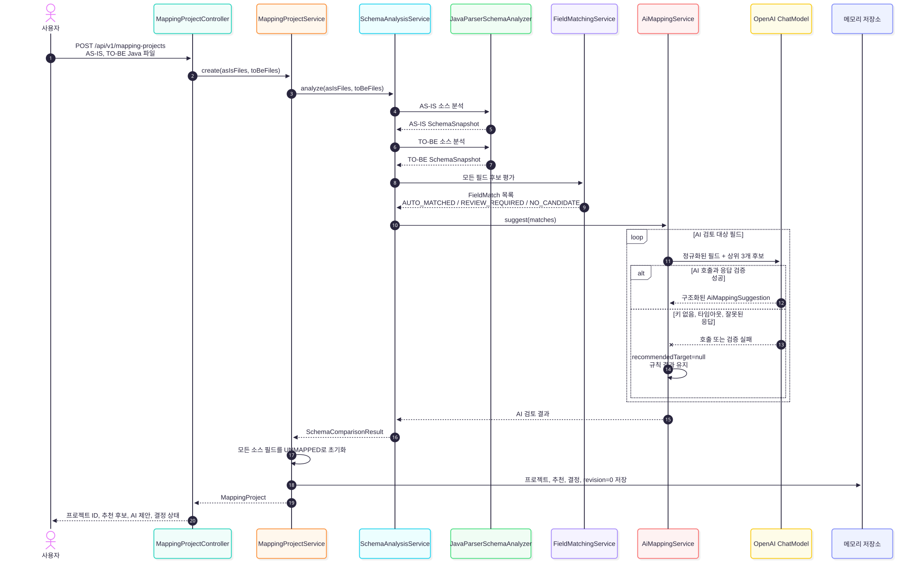
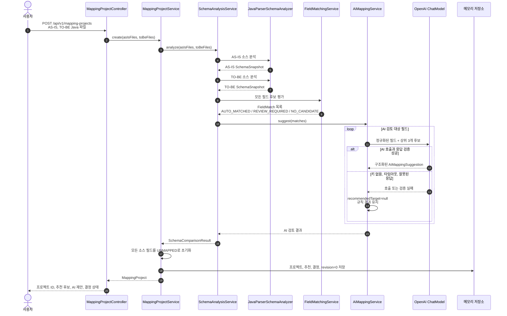
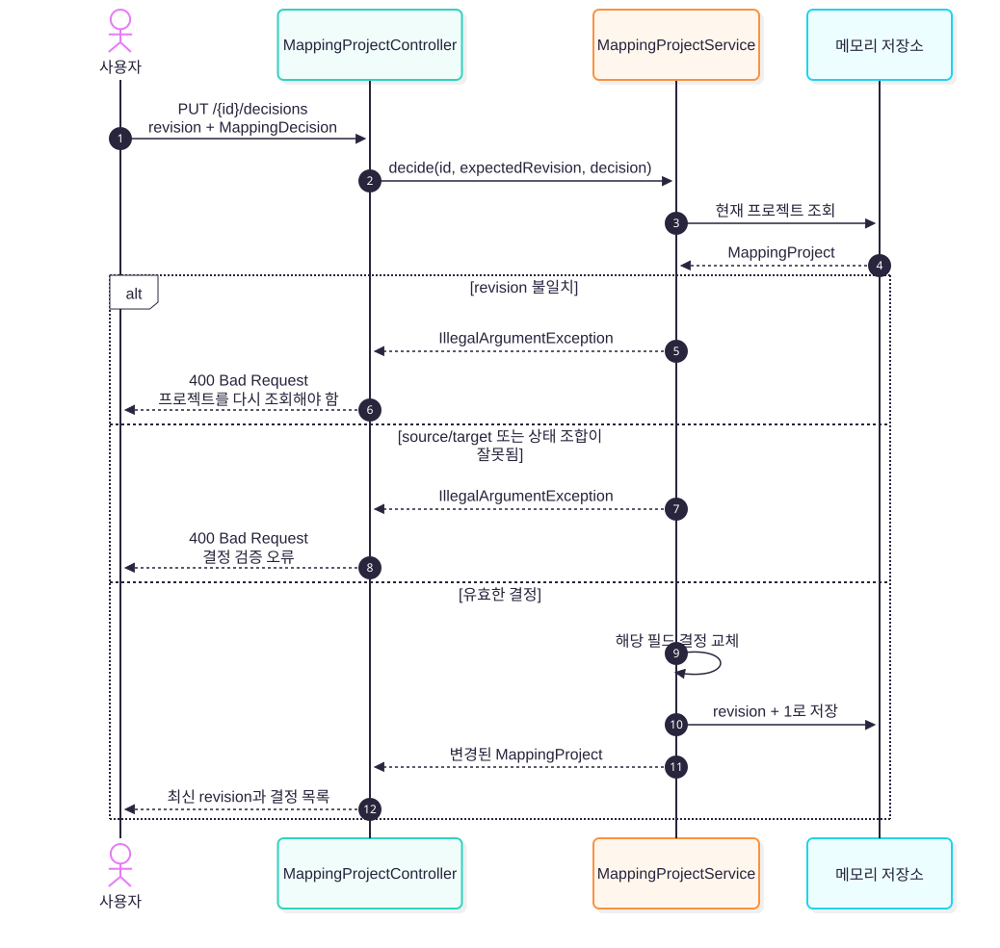
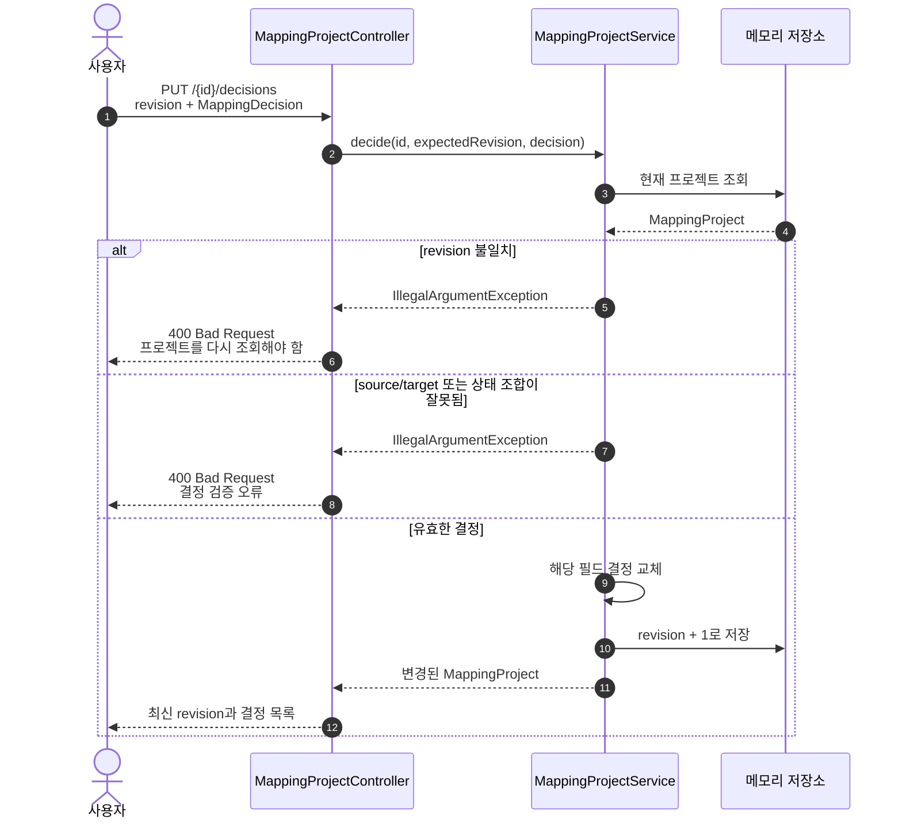
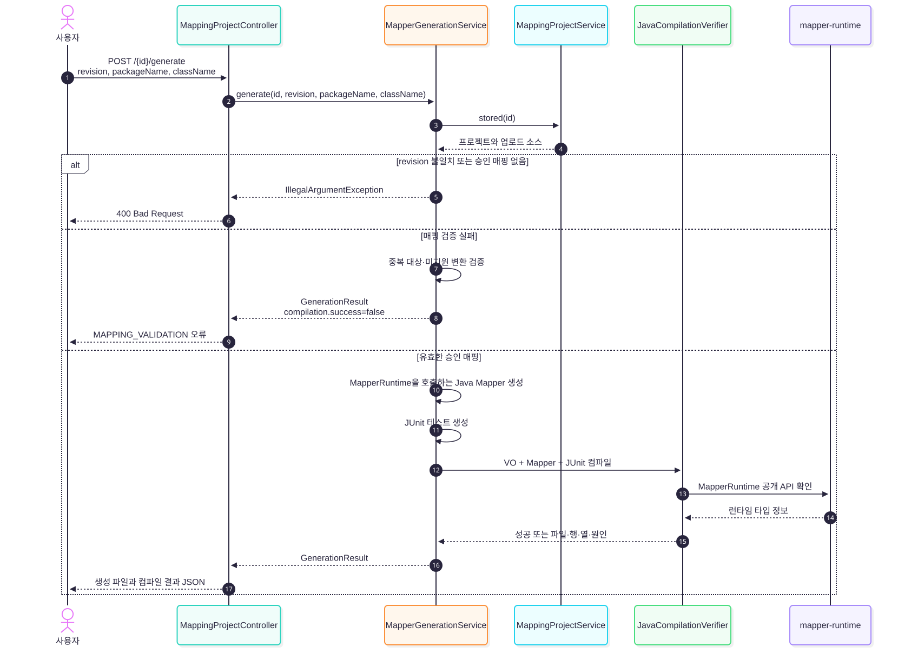
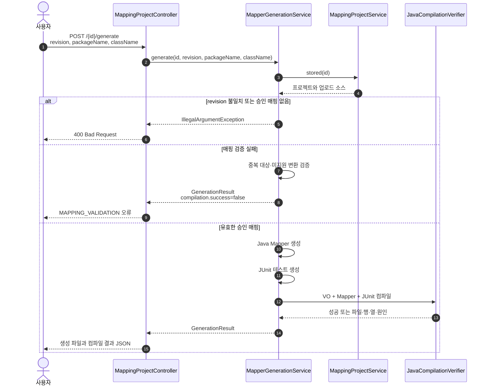
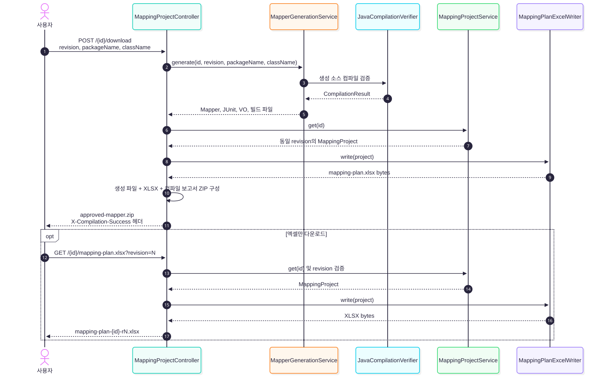
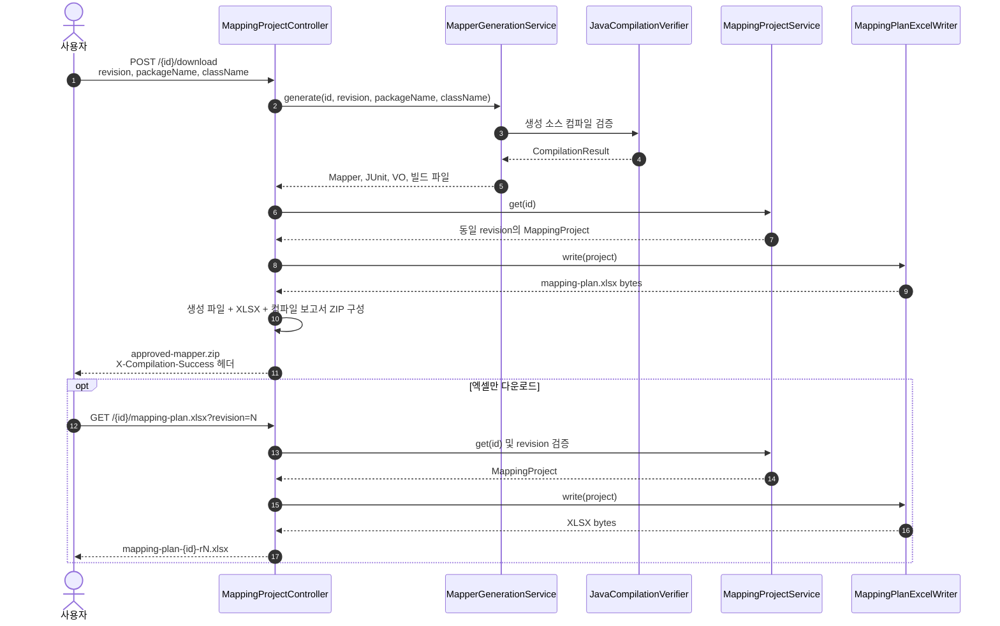
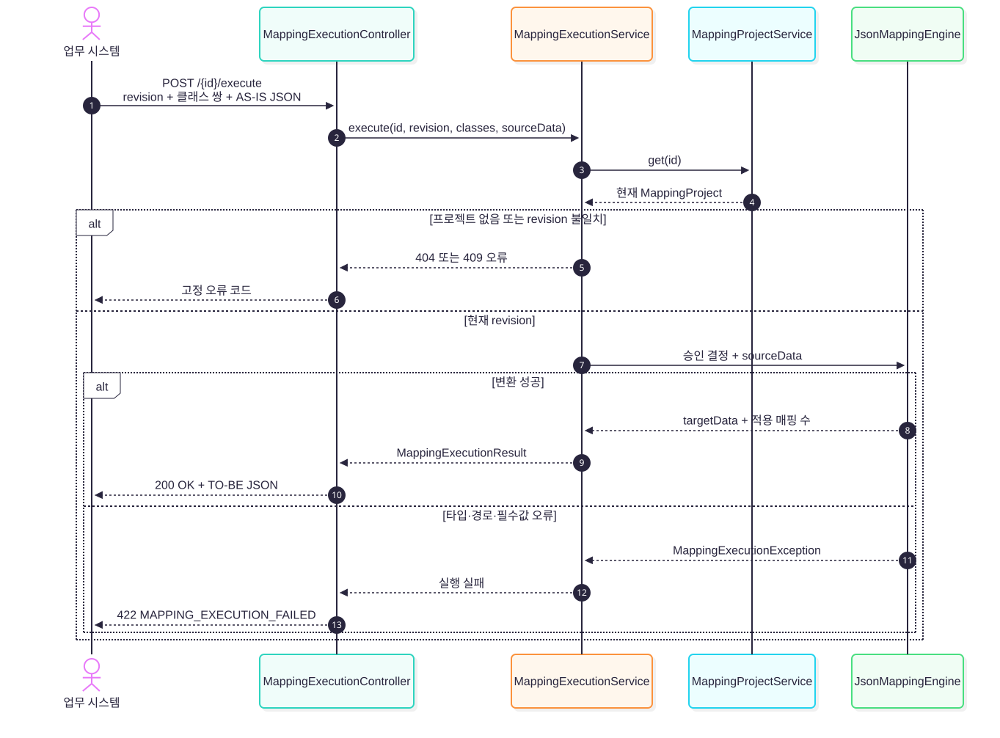
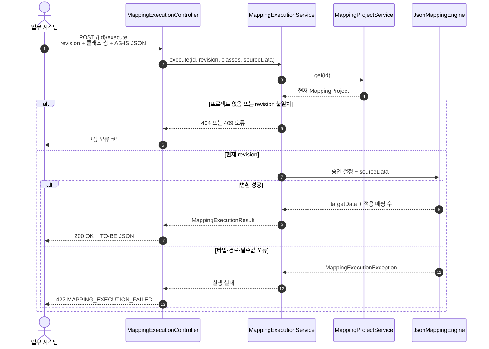

# 매핑 시스템 시퀀스 다이어그램

이 문서는 현재 구현된 VO 분석, 후보 추천, 사용자 승인, Mapper·JUnit·엑셀 생성 흐름을 설명합니다.
실제 업무 데이터 변환 API는 아직 구현되지 않았으며 문서 마지막에 향후 흐름으로 분리했습니다.

## 1. VO 분석과 후보 생성

`POST /api/v1/mapping-projects`는 AS-IS와 TO-BE Java 파일을 분석하고 필드별 후보를 생성합니다.
AI에는 전체 소스나 전체 스키마를 보내지 않고 `REVIEW_REQUIRED`이면서 최고 후보 점수가 설정값 이상인
필드의 정규화 정보와 상위 3개 후보만 전달합니다.



<details>
<summary>Mermaid 원본 보기</summary>



</details>

규칙 결과와 AI 제안은 추천 정보입니다. `AUTO_MATCHED`나 높은 AI 신뢰도만으로 최종 결정이
`APPROVED`가 되지는 않습니다.

## 2. 사용자 결정 저장

`PUT /api/v1/mapping-projects/{id}/decisions`는 추천과 분리된 최종 결정을 저장합니다.
클라이언트가 보낸 revision이 현재 revision과 다르면 오래된 화면의 변경으로 판단해 거부합니다.



<details>
<summary>Mermaid 원본 보기</summary>



</details>

상태별 코드 생성 여부는 다음과 같습니다.

| 상태 | 의미 | Mapper 포함 |
| --- | --- | --- |
| `UNMAPPED` | 아직 결정하지 않음 | 아니오 |
| `MODIFIED` | 추천을 수정했지만 아직 승인하지 않음 | 아니오 |
| `REJECTED` | 매핑하지 않기로 결정 | 아니오 |
| `APPROVED` | 대상 필드와 변환 방식을 확정 | 예 |

## 3. Mapper 생성과 컴파일 검증

`POST /api/v1/mapping-projects/{id}/generate`는 JSON으로 생성 파일과 컴파일 결과를 반환합니다.
생성기는 동일 revision의 `APPROVED` 결정만 사용합니다.



<details>
<summary>Mermaid 원본 보기</summary>



</details>

컴파일 검증은 코드를 실행하지 않으며 애노테이션 프로세서도 비활성화합니다. 컴파일이 성공해도
런타임 reflection 접근이나 실제 업무 의미의 정확성까지 보장하지는 않습니다.

## 4. Mapper와 매핑 계획 다운로드

`POST /api/v1/mapping-projects/{id}/download`는 Mapper 구현과 매핑 계획 엑셀을 하나의 ZIP으로
반환합니다. `GET /api/v1/mapping-projects/{id}/mapping-plan.xlsx`는 엑셀만 반환합니다.



<details>
<summary>Mermaid 원본 보기</summary>



</details>

ZIP에는 다음 파일이 포함됩니다.

```text
src/main/java/.../ApprovedMapper.java
src/test/java/.../ApprovedMapperTest.java
sources/as-is/...
sources/to-be/...
mapping-plan.xlsx
compilation-report.json
build.gradle
README.txt
```

## 5. 외부 시스템 실데이터 변환 흐름

`POST /api/v1/mapping-projects/{id}/execute`는 저장된 승인 계획으로 AS-IS JSON을 TO-BE JSON으로
변환합니다. 실행 단계에서는 AI, 규칙 재분석, 코드 생성과 컴파일을 호출하지 않습니다.



<details>
<summary>Mermaid 원본 보기</summary>



</details>

현재 `MappingProjectService`는 프로젝트와 결정을 메모리에 저장하므로 서버 재시작 시 사라집니다.
실데이터 실행 API를 운영 배포하기 전에는 승인 계획을 DB 또는 버전 관리 파일에 영구 저장해야 합니다.
